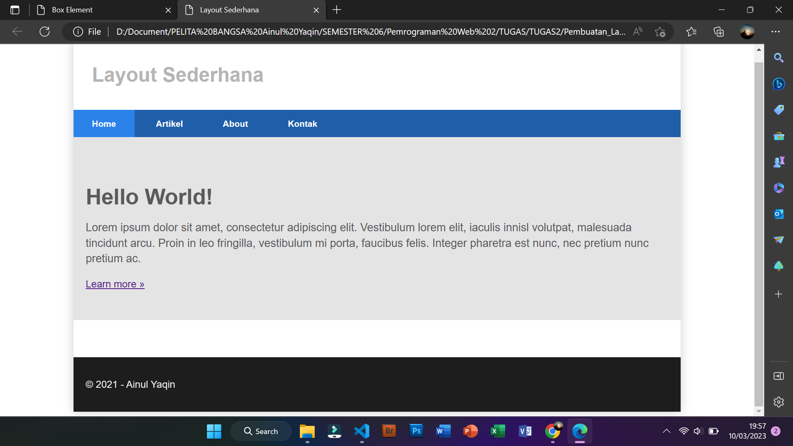

# PEMROGRAMAAN WEB 2

Ainul Yaqin (312010423)

Teknik Informatika - UNIVERSITAS PELITA BANGSA
______________________________________________

## MEMBUAT BOX ELEMENT

Pertama, disini saya akan membuat sebuah dokumen dasar Htmlnya terlebih dahulu, sebelum nantinya akan saya tambahkan kode untuk membuat sebuah Box Element.


Berikut codingan yang saya gunakan untuk membuat sebuah dokumen dasar dengan judul Box Element dari Html.

```html
<!DOCTYPE html>
<html lang="en">
<head>
    <meta charset="UTF-8">
    <meta name="viewport" content="width=device-width, initial-scale=1.0">
    <title> Element</title>
</head>
<body>
    <header>
        <h1>Box Element</h1>
    </header>
</body>
</html>    
```

Setelah membuat dasarnya seperti diatas, selanjutnya tambahkan sebuah kode untuk membuat Box Element dengan tag div seperti dibawah ini:


Dengan menggunakan kode berikut:

```html
<section>
    <div class="div1">Div 1</div>
    <div class="div2">Div 2</div>
    <div class="div3">Div 3</div>
</section>
```


Dan jika kalian ingin divnya lebih berwarna atau lebih bervariasi lagi seperti gambar diatas, kalian dapat menggunakan kode dibawah ini pada bagian headnya untuk membuat sebuah deklarasi CSS Float Property.

```html
<style>
    div {
        float:left;
        padding: 10px;
        }
        .div1 {
            background: red;
        }
        .div2 {
            background: yellow;
        }
        .div3 {
            background: green;
        }
    </style>
```

## PENGATURAN CLEARFIX ELEMENT

Setelah membuat Box Element dengan tag div yang sudah di variasikan, selajutnya yang akan kita lakukan yaitu melakukan Clearfix atau pengaturan lanjutan untuk Box Element yang sebelumnya sudah dilakukan Float Element seperti diatas dengan menambahkan div lainnya setelah Div3 seperti berikut.

```html
<section>
    <div class="div1">Div 1</div>
    <div class="div2">Div 2</div>
    <div class="div3">Div 3</div>
    <div class="div4">Div 4</div>
</section>
```


Kemudian untuk mengaturnya menjadi seperti gambar diatas, kalian dapat memasukan kode berikut:

```html
.div4 {
        background-color: rgb(180, 146, 176);
        clear: left;
        float: none;
    }
```

## MEMBUAT LAYOUT SEDERHANA

Untuk dapat membuat sebuah Layout Sederhana, langkah awal yang perlu dilakuan ialah membuat sebuah sebuah folder baru yang kemudian didalamnya terdapat sebuah file baru berbasis html dan juga css.


Berikut kode yang saya gunakan untuk membuat folder baru tersebut yang nantinya akan nampak seperti gambar diatas.

```html
<!DOCTYPE html>
<html lang="en">

<head>
    <meta charset="UTF-8">
    <meta name="viewport" content="width=device-width, initial-scale=1.0">
    <title>Layout Sederhana</title>
    <link rel="stylesheet" href="style.css">
</head>
<body>
    <div id="container">
        <header>
            <h1>Layout Sederhana</h1>
        </header>
        <nav>
            <a href="home.html" class="active">Home</a>
            <a href="artikel.html">Artikel</a>
            <a href="about.html">About</a>
            <a href="kontak.html">Kontak</a>
        </nav>
        <section id="hero"></section>
        <section id="wrapper">
            <section id="main"></section>
            <aside id="sidebar"></aside>
        </section>
        <footer>
            <p>&copy; 2021 - Ainul Yaqin</p>
        </footer>
    </div>
</body>
</html>
```

Setelah itu, kalian dapat menambahkan kode lainnya pada file CSS dengan kode berikut:

```css
/* import google font */
@import
url('https://fonts.googleapis.com/css2?family=Open+Sans:ital,wght@0,300;0,400;0,600;0,700;0,800;1,300;1,400;1,600;1,700;1,800&display=swap');
@import
url('https://fonts.googleapis.com/css2?family=Open+Sans+Condensed:ital,wght@0,300;0,700;1,300&display=swap');

/* Reset CSS */
* {
    margin: 0;
    padding: 0;
}
body {
    line-height:1;
    font-size:100%;
    font-family:'Open Sans', sans-serif;
    color:#5a5a5a;
}
#container {
    width: 980px;
    margin: 0 auto;
    box-shadow: 0 0 1em #cccccc;
}

/* header */
header {
    padding: 20px;
}
header h1 {
    margin: 20px 10px;
    color: #b5b5b5;
}
```

## MEMBUAT NAVIGASI


Untuk dapat melakukan sebuah pengaturan navigasi seperti diatas kalian dapat menambahkan kode berikut pada file CSS sebelumnya.

```css
/* navigasi */
nav {
    display: block;
    background-color: #1f5faa;
}
nav a {
    padding: 15px 30px;
    display: inline-block;
    color: #ffffff;
    font-size: 14px;
    text-decoration: none;
    font-weight: bold;
}
nav a.active,
nav a:hover {
    background-color: #2b83ea;
}
```

## PEMBUATAN HERO PANEL



Dalam pembuatan Hero Panel kalian perlu memasukan kode Html dan juga CSS seperti berikut ini:

```html
<section id="hero">
    <h1>Hello World!</h1>
    <p>Lorem ipsum dolor sit amet, consectetur adipiscing elit. Vestibulum lorem
elit, iaculis innisl volutpat, malesuada tincidunt arcu. Proin in leo fringilla,
vestibulum mi porta, faucibus felis. Integer pharetra est nunc, nec pretium nunc
pretium ac.</p>
    <a href="home.html" class="btn btn-large">Learn more &raquo;</a>
</section>
```

```css
/* Hero Panel */
#hero {
    background-color: #e4e4e5;
    padding: 50px 20px;
    margin-bottom: 20px;
}
#hero h1 {
    margin-bottom: 20px;
    font-size: 35px;
}
#hero p {
    margin-bottom: 20px;
    font-size: 18px;
    line-height: 25px;
}
```


## PENGATURAN LAYOUT MAIN DAN SIDEBAR

 Selanjutnya, melakukan sebuah pengaturan main content dan sidebar, dengan menambahkan kode CSS float berikut ini:

 ```css
 /* main content */
#wrapper {
    margin: 0;
}
#main {
    float: left;
    width: 640px;
    padding: 20px;
}

/* sidebar area */
#sidebar {
    float: left;
    width: 260px;
    padding: 20px;
}
```

## PEMBUATAN SIDEBAR WIDGET


Untuk menambahkan element lain dalam sidebar dan sebuah Widget CSS seperti gambar diatas, kalian dapat menggunakan kode berikut:

```html
<aside id="sidebar">
    <div class="widget-box">
        <h3 class="title">Widget Header</h3>
        <ul>
            <li><a href="#">Widget Link</a></li>
            <li><a href="#">Widget Link</a></li>
            <li><a href="#">Widget Link</a></li>
            <li><a href="#">Widget Link</a></li>
            <li><a href="#">Widget Link</a></li>
        </ul>
    </div>
    <div class="widget-box">
        <h3 class="title">Widget Text</h3>
        <p>Vestibulum lorem elit, iaculis in nisl volutpat, malesuada tincidunt
arcu. Proin in leo fringilla, vestibulum mi porta, faucibus felis. Integer
pharetra est nunc, nec pretium nunc pretium ac.</p>
    </div>
</aside>
```

```css
/* widget */
.widget-box {
    border: 1px solid #eee;
    margin-bottom: 20px;
}
.widget-box .title {
    padding: 10px 16px;
    background-color: #428bca;
    color: #fff;
}
.widget-box ul {
    list-style-type:none;
}
.widget-box li {
    border-bottom: 1px solid  #eee;
}
.widget-box li a {
    padding: 10px 16px;
    color: #333;
    display: block;
    text-decoration: none;
}
.widget-box li:hover a {
    background-color: #eee;
}
.widget-box p {
    padding: 15px;
    line-height: 25px;
}
```


```css


## PENAMBAHAN ELEMEN LAIN PADA MAIN CONTENT


Penambahan elemen lainnya pada Main Content seperti gambar diatas dibutuhkan sebuah kode html dan CSS seperti dibawah ini:

```html
<section id="main">
    <div class="row">
        <div class="box">
            
            <h3>Heading</h3>
            <p>Donec sed odio dui. Etiam porta sem malesuada magna mollis
euismod.</p>
            <a href="#" class="btn btn-default">View detail</a>
        </div>
        <div class="box">
            
            <h3>Heading</h3>
            <p>Donec sed odio dui. Etiam porta sem malesuada magna mollis
euismod.</p>
            <a href="#" class="btn btn-default">View detail</a>
        </div>
        <div class="box">
            
            <h3>Heading</h3>
            <p>Donec sed odio dui. Etiam porta sem malesuada magna mollis
euismod.</p>
            <a href="#" class="btn btn-default">View detail</a>
        </div>
    </div>
</section>
```
```css
/* box */
.box {
    display:block;
    float:left;
    width:33.333333%;
    box-sizing:border-box;
    -moz-box-sizing:border-box;
    -webkit-box-sizing:border-box;
    padding:0 10px;
    text-align:center;
}
.box h3 {
    margin: 15px 0;
}
.box p {
    line-height: 20px;
    font-size: 14px;
    margin-bottom: 15px;
}
box img {
    border: 0;
    vertical-align: middle;
}
.image-circle {
    border-radius: 50%;
}
.row {
    margin: 0 -10px;
    box-sizing: border-box;
    -moz-box-sizing: border-box;
    -webkit-box-sizing: border-box;
}
.row:after, .row:before,
.entry:after, .entry:before {
    content:'';
    display:table;
}
.row:after,
.entry:after {
    clear:both;
}
```

## PENAMBAHAN CONTENT ARTIKEL


Untuk dapat membuat sebuah Content Artikel atau sebuah poit penting dalam sebuah artikel seperti gambar diatas, dibutuhkan sebuah kode Html dan juga CSS seperti dibawah ini:

```html
<hr class="divider" />
<article class="entry">
    <h2>First featurette heading.</h2>
    
    <p>Lorem ipsum dolor sit amet, consectetur adipiscing elit. Vestibulum lorem
elit, iaculis in nisl volutpat, malesuada tincidunt arcu. Proin in leo fringilla,
vestibulum mi porta, faucibus felis. Integer pharetra est nunc, nec pretium nunc
pretium ac.</p>
</article>
<hr class="divider" />
<article class="entry">
    <h2>First featurette heading.</h2>
    
    <p>Lorem ipsum dolor sit amet, consectetur adipiscing elit. Vestibulum lorem
elit, iaculis in nisl volutpat, malesuada tincidunt arcu. Proin in leo fringilla,
vestibulum mi porta, faucibus felis. Integer pharetra est nunc, nec pretium nunc
pretium ac.</p>
</article>
```

```css
.divider {
    border:0;
    border-top:1px solid #eeeeee;
    margin:40px 0;
}
/* entry */
.entry {
    margin: 15px 0;
}
.entry h2 {
    margin-bottom: 20px;
}
.entry p {
    line-height: 25px;
}
.entry img {
    float: left;
    border-radius: 5px;
    margin-right: 15px;
}
.entry .right-img {
    float: right;
}

```
## SEPERTI INILAH HASIL AKHIRNYA

